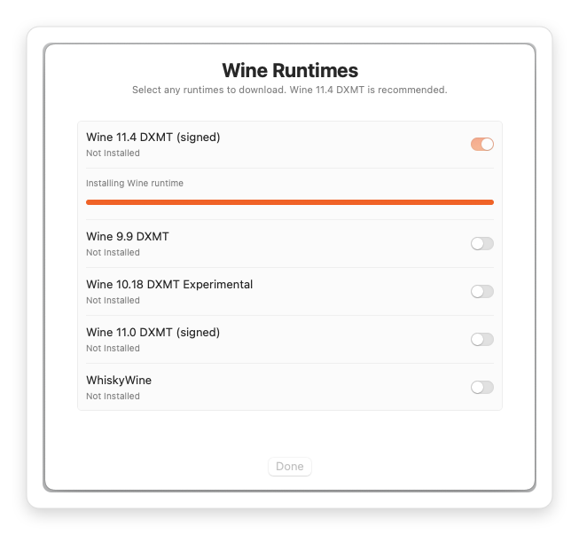
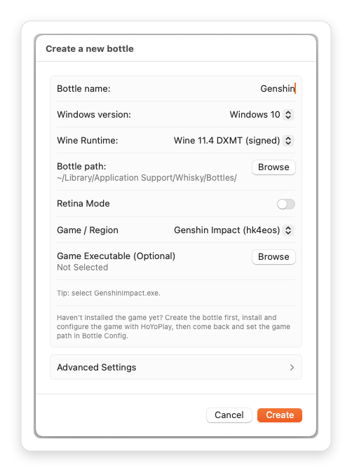
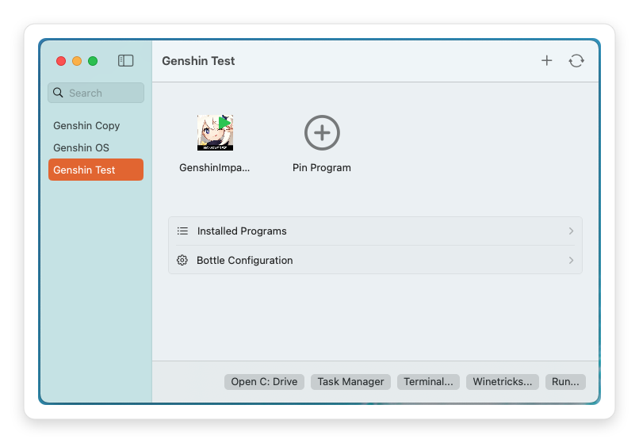

# Whisky YAAGL Fork

An app for running HK4e, NAP, and HKRPG on macOS with less setup hassle.

[中文文档](README.zh-CN.md)

## What This App Is

This is a macOS game launcher and management tool for general users. It is mainly intended to make certain anime-style games easier to run, but it is not limited to those games. It is built on top of [Whisky](https://github.com/Whisky-App/Whisky), references the Wine environment setup and patching approach used by [YAAGL](https://github.com/yaagl/yet-another-anime-game-launcher), and follows a workflow closer to CrossOver to make game setup, launching, and day-to-day management easier.

This project is an independently maintained fork and is not affiliated with the original Whisky or YAAGL projects.

## Screenshots

  
  

### Main Window

## Main Features

- Choose from multiple Wine versions when creating a bottle
- Supports some patches from upstream YAAGL
- Each bottle has its own isolated Wine runtime
- Can run multiple instances of the same game, or different games, at the same time
- Supports per-bottle proxy settings
- Supports fast duplication with APFS clone, so duplicate files only take the space of a single copy

## System Requirements

- Apple Silicon Mac
- macOS 15 or later

## Is it safe?

Use at your own risk.

## Installation

1. Prefer downloading the latest `whisky-yaagl.app.zip` from `Releases`.
2. `Actions` builds are mainly for preview/testing and may be unstable.
3. Unzip it in `Finder`.
4. Drag `whisky-yaagl.app` into `/Applications`.
5. Launch it from `Applications`; on first launch the app will guide you through downloading a Wine runtime (recommended: `Wine 11.4 DXMT (signed)`).
6. Runtime downloads are cached locally, and each bottle builds its own isolated runtime from the selected base runtime.

If macOS blocks the app on first launch:

1. Open `System Settings` -> `Privacy & Security`.
2. Find the blocked app message and click `Open Anyway`.

## Quick Start

1. Install the app from `Releases` (see `Installation`).
2. Launch the app once and let it download a Wine runtime (recommended: `Wine 11.4 DXMT (signed)`).
3. Choose the game executable path, then create the bottle.
4. For patch-related options, keeping the defaults is recommended unless you know you need to change them.
5. Launch from the pinned program (or the program list).

## Compared With YAAGL

This fork borrows HK4e workflow ideas from YAAGL, but adapts them to Whisky's bottle-first model (multiple bottles, preconfigured setup) instead of a single-app, per-launch patch/revert flow.

- Independent bottles: different games and runtime setups stay fully separated, avoiding cross-contamination.
- Parallel bottles: you can run the same game or different games at the same time without affecting each other.
- More stable day-to-day use: if one bottle breaks, you can delete and rebuild just that bottle without reinstalling the whole app.
- Preconfigured workflow: most options are applied during bottle creation or when toggled in Config, instead of patching and reverting on every launch.
- Fast switching: Wine downloads are cached locally, so switching versions or rebuilding bottles usually does not require downloading Wine again.
- Native macOS app experience: faster launch, smoother interaction, and lower resource usage.

## Storage Location

This fork stores data here:

- `~/Library/Application Support/whisky-yaagl/`
  - `Bottles/`
  - `Libraries/`
  - `Downloads/`
- `~/Library/Logs/whisky-yaagl/`

If older `Whisky` data exists, the app will try to migrate it on first launch.

Note: per-bottle runtime isolation works best on APFS volumes (so the app can use clone/copy-on-write when duplicating bottles).

## Logs

Logs are stored in:

- `~/Library/Logs/whisky-yaagl/`

Recent versions of this fork try to keep one launch session in one log file, so startup troubleshooting is easier.

## Need Help?

If a game fails to start, the most useful things to check are:

1. The latest log in `~/Library/Logs/whisky-yaagl/`
2. Whether the game executable path still exists and the drive is still mounted
3. Use HoYoPlay to verify game file integrity

## Credits

This project is built on top of Whisky and the work of the Wine, DXVK, MoltenVK, CrossOver, and Apple D3DMetal communities.

## Special Thanks

- [YAAGL](https://github.com/yaagl/yet-another-anime-game-launcher) for the HK4e-oriented workflow ideas and reference behavior.
- [Whisky](https://github.com/Whisky-App/Whisky) for the base app and the macOS Wine bottle experience.

Please also support the upstream projects that make this fork possible.
